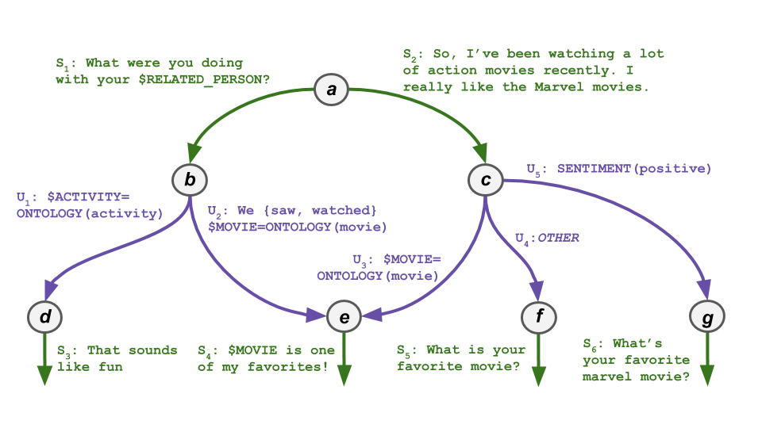

## Portfolio

---

[Emora Chatbot: Winner of Amazon Alexa Prize 3](https://m.media-amazon.com/images/G/01/mobile-apps/dex/alexa/alexaprize/assets/challenge3/proceedings/Emory-Emora.pdf)

I was the co-team-lead for Emory University's 14-person student team participating in the 3rd Amazon Alexa Prize. The goal of this challenge was to develop the most engaging and capable dialogue agent. We were one of 10 teams invited to participate based on our proposal, out of approximately 400 applicants. The competition lasted from August 2019 to July 2020, in which we developed and deployed our chatbot Emora to Amazon Alexa Devices that any user could connect to. In July 2020, we won this year's competition, advancing through two elimination rounds based on user ratings and then receiving the highest overall rating from the panel of final invited judges.

The system architecture of the Emora Chatbot:

An illustration of the core dialogue logic representing the state-machine-based dialogue flow:

An example conversation Emora can hold:

The user ratings Emora received during the quarter and semifinal rounds of the competition:

Code for running the winning Emora is available at the [Emora Github Repository](https://github.com/emora-chat/emora_ap3_parlai).

- [Amazon News Article](https://www.amazon.science/latest-news/alexa-prize-interviews?fbclid=IwAR2Iu7HwssbVvqmy1AB2gSOtZfoOps5nbxcpQqlTLgrz1czMtWnEH5X1JVY)
- [Emory News Article](https://news.emory.edu/stories/2020/08/er_alexa_prize/campus.html)
- [Youtube Playlist](https://www.youtube.com/playlist?list=PLsMGYQfhCveJE1uSslBZjoiRAVHDJoiQa)

---
[Project 2 Title](/pdf/sample_presentation.pdf)

---
[Project 3 Title](http://example.com/)

---

---

Page template forked from <a href="https://github.com/evanca/quick-portfolio">evanca</a>

<!-- Remove above link if you don't want to attibute -->
