# Portfolio

### 1. -- Emora Chatbot: Winner of Amazon Alexa Prize 3 (2020)

I was one team lead of the university team who developed the Emora chatbot during the Amazon Alexa Prize Socialbot Grand Challenge and won the competition in 2020, advancing through two elimination rounds based on user ratings and then receiving the highest overall rating from the panel of final invited judges.

An example conversation Emora can hold:
 
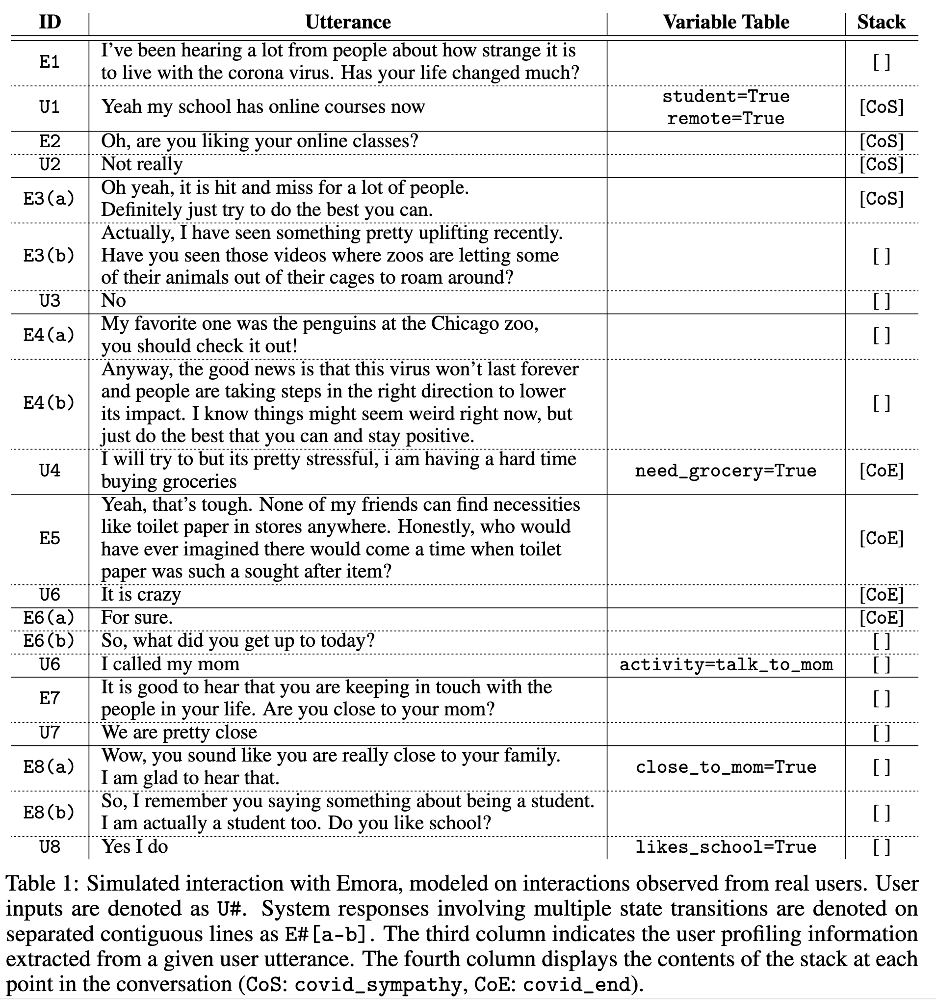

The system architecture of the Emora Chatbot:
 
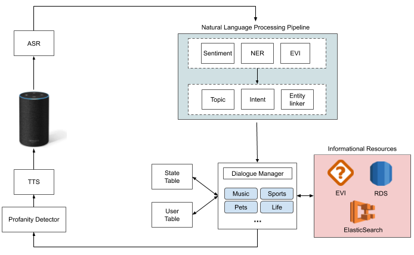

The user ratings Emora received during the quarter and semifinal rounds of the competition:
 
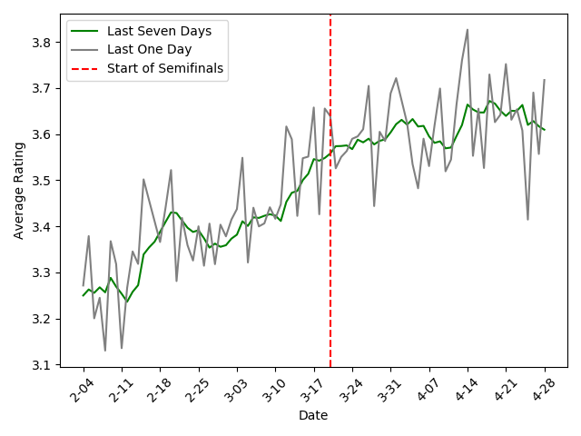

**More Information:**
* Read the Amazon Technical Proceedings paper [here](https://m.media-amazon.com/images/G/01/mobile-apps/dex/alexa/alexaprize/assets/challenge3/proceedings/Emory-Emora.pdf)

* &#9733; Code for running the winning Emora is available at the [Emora Github Repository](https://github.com/emora-chat/emora_ap3_parlai).

* Emora in the News in an [Amazon Article](https://www.amazon.science/latest-news/alexa-prize-interviews?fbclid=IwAR2Iu7HwssbVvqmy1AB2gSOtZfoOps5nbxcpQqlTLgrz1czMtWnEH5X1JVY) and an [Emory Article](https://news.emory.edu/stories/2020/08/er_alexa_prize/campus.html)!

* Learn more about Emora from our [Youtube Playlist](https://www.youtube.com/playlist?list=PLsMGYQfhCveJE1uSslBZjoiRAVHDJoiQa)!

---

### 2. --Article QABot using Generative AI

As an intern, I developed an article-grounded conversational question-answering dialogue system that ingests online FAQ documents in order to offer customer support. I worked on the evaluation and integration of numerous approaches to dialogue-relevant tasks into the dialogue system, including information-retrieval, hallucination-detection, and response generation, focusing on prompt-based large language model approaches.

An example prompt for response generation:
 

  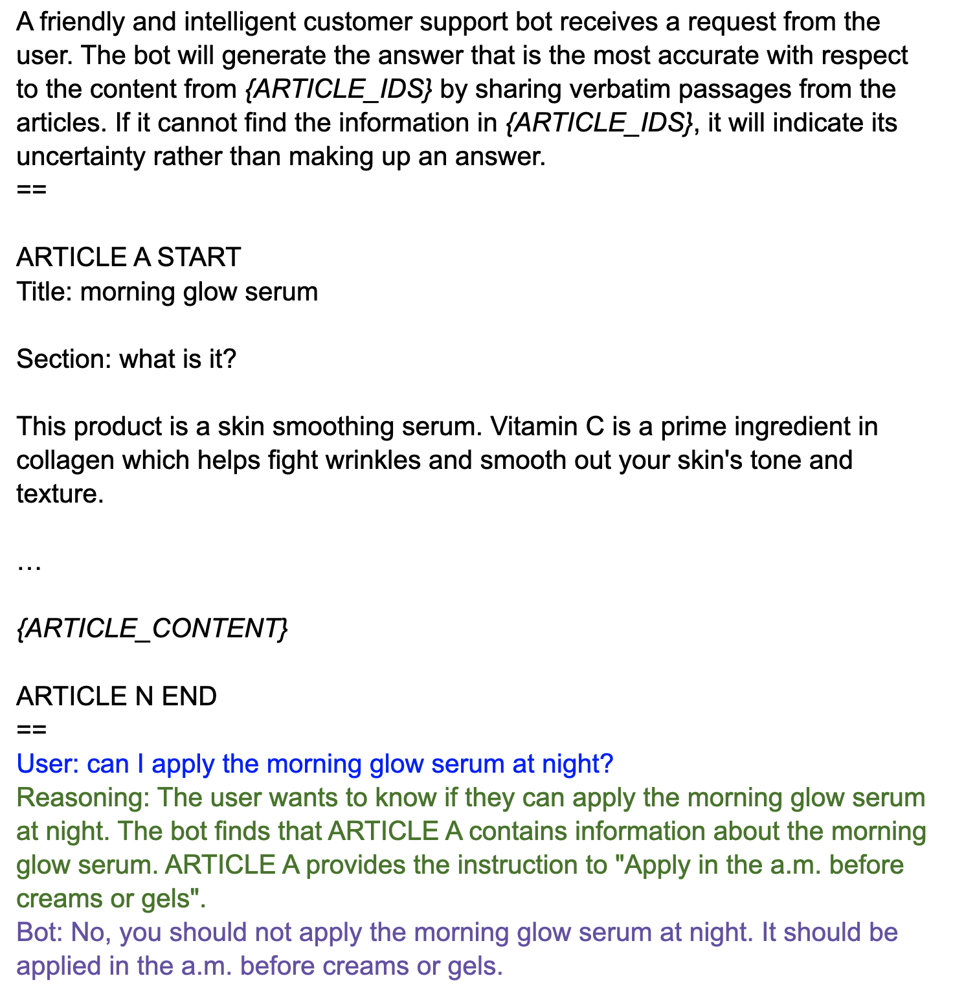

Overall Article QABot architecture:
 
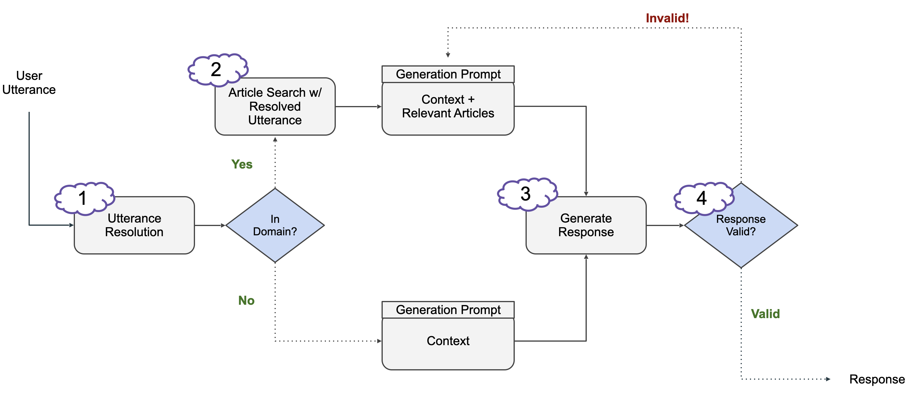

Measured response correctness for Article QABot:
 
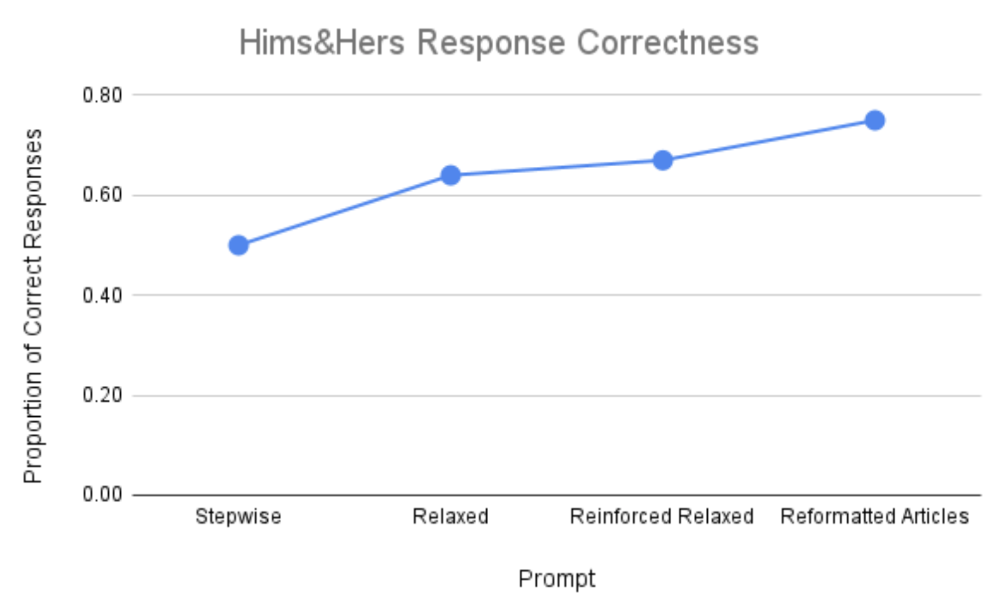

---

### 3. -- ConvoSenseGenerator

I developed ConvoSenseGenerator, a fine-tuned T5 model that generates commonsense inferences for a provided dialogue context. It is fine-tuned on a new dialogue commonsense dataset, ConvoSense, collected using GPT that boasts greater contextual novelty, a higher volume of inferences per example, and substantially enriched detail compared to previous datasets. 

Example commonsense inference outputs of the ConvoSenseGenerator:
 
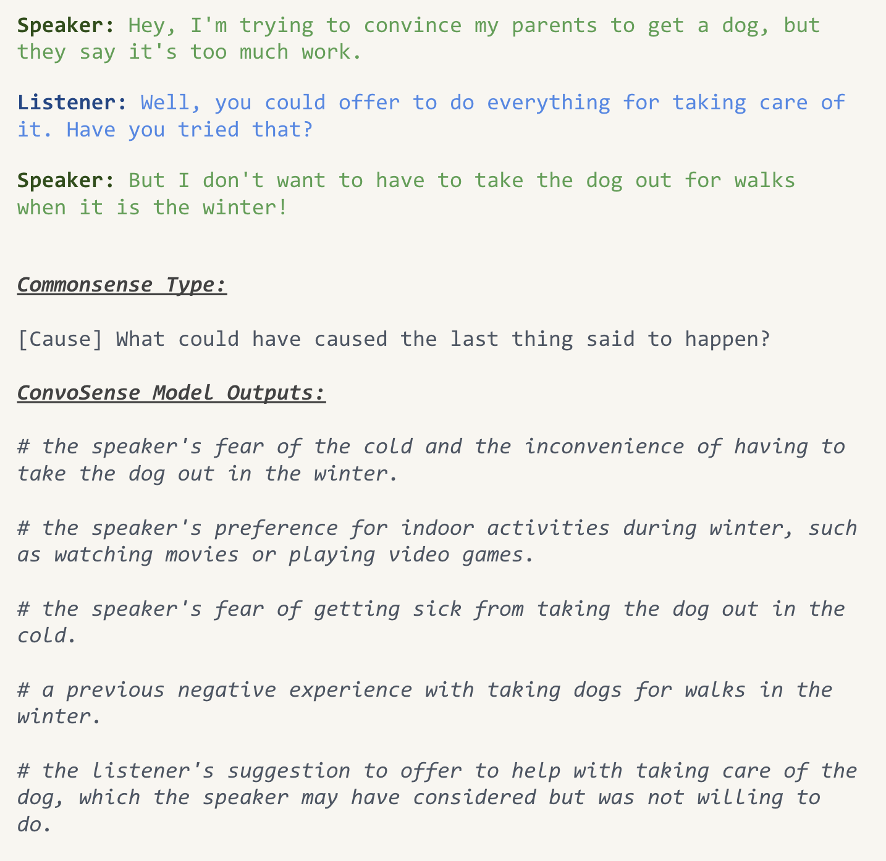

Illustration of the ConvoSense ChatGPT framework including an example of the prompt: 
 
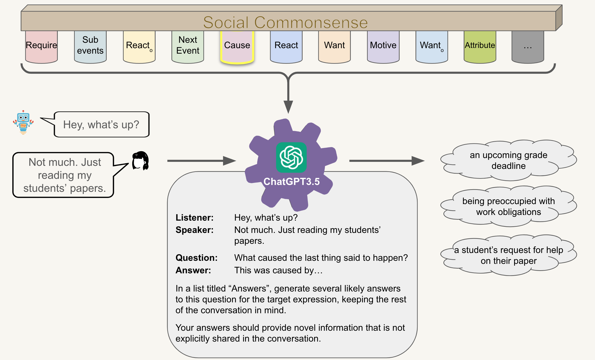

Empirical results from human evaluation demonstrating the superiority of the ConvoSenseGenerator:
 
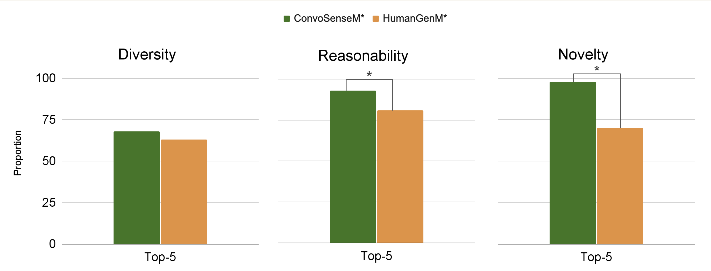

**More Information:**

* Read the TACL 2024 paper [here](https://aclanthology.org/2023.acl-long.839/)!

* &#9733; Code for the ConvoSense project is available at the [Github repository]()

* &#9733; **Trained Model:** Our best-performing ConvoSense-trained model is released through HuggingFace [here](https://huggingface.co/sefinch/ConvoSenseGenerator)!

---

### 4. -- Explicit Reasoning over Commonsense for Dialogue Response Generation

I developed a commonsense-grounded chatbot that leverages explicit reasoning similar to chain-of-thought prompting to integrate ConvoSenseGenerator outputs into dialogue response generation using GPT.

Example dialogue showing motivation of explicit reasoning over commonsense inferences to guide follow-up response generation:
 
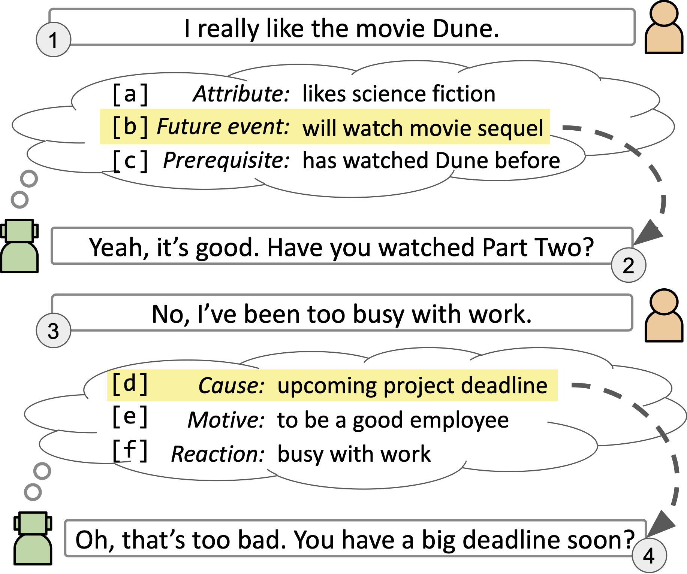

Illustrative responses generated from the proposed approach (CS-E) and alternatives:
 
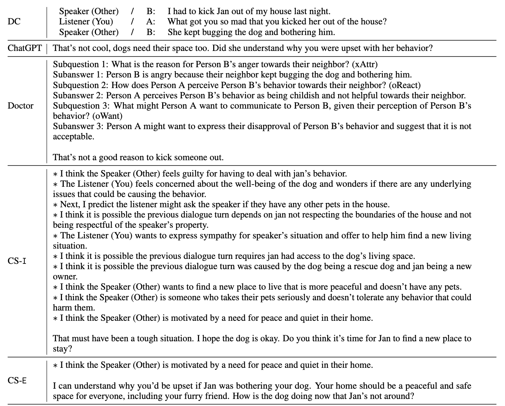

Human evaluation results showing superiority of proposed approach (ConvoSense-E) against alternatives:
 
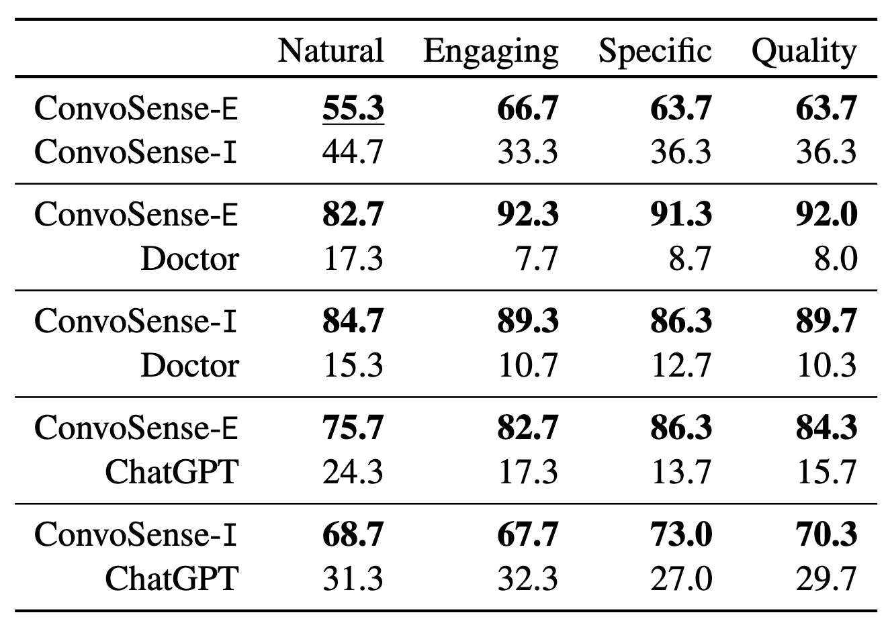

---

### 5. -- Annotation of Behaviors in Chat Evaluation (ABC-Eval): Dialogue System Evaluation Framework

I collaborated to develop a novel evaluation framework for chat-oriented dialogue systems that measures the rate of 16 different dialogue behaviors that can be expressed by chatbots. ABC-Eval is a web-based annotation platform that was built on top of the ParlAI Javascript framework with major modifications to support the annotation requirements of the 16 ABC-Eval tasks. 

The online interface for annotating the usage of Correct Facts and Incorrect Facts:
 
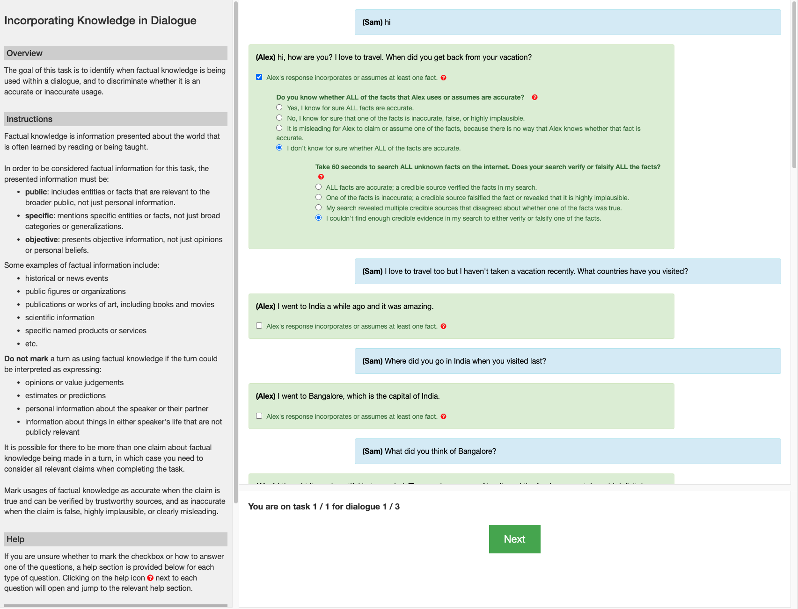

The online interface for annotating consistency mistakes:
 
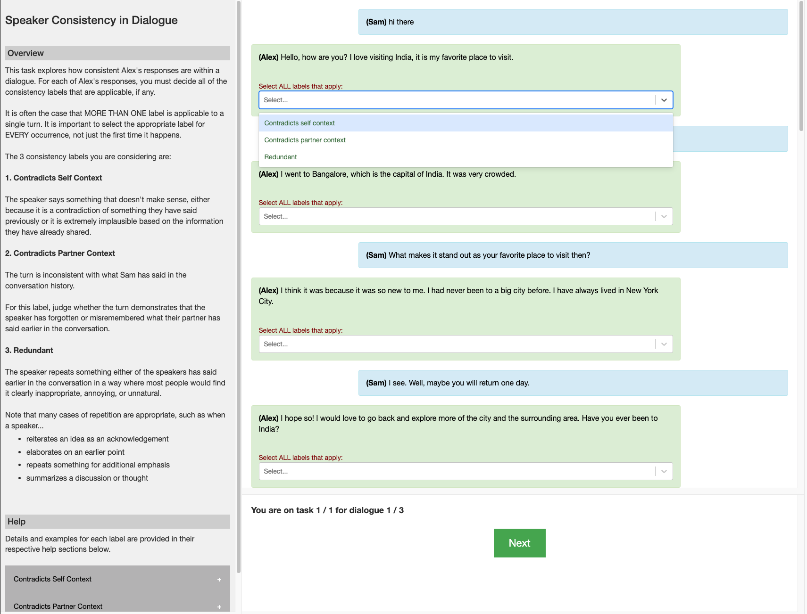

**More Information:**

* Read the ACL 2023 paper [here](https://aclanthology.org/2023.acl-long.839/)!

* &#9733; Code for running the ABC-Eval platform is available at the [Github repository](https://github.com/emorynlp/ChatEvaluationPlatform)

---

Page template forked from <a href="https://github.com/evanca/quick-portfolio">evanca</a>

<!-- Remove above link if you don't want to attibute -->
