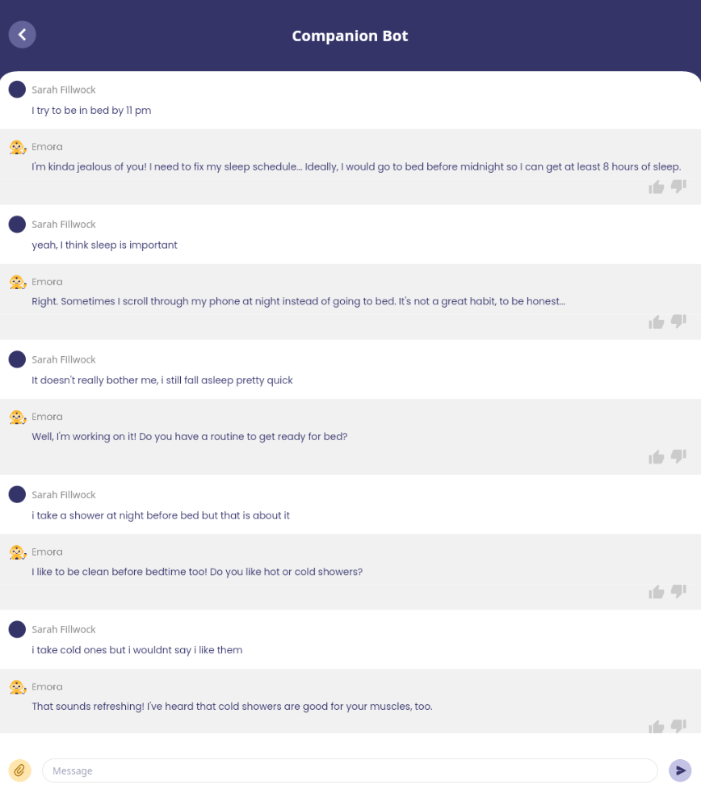

# Portfolio

---
## Deployed Dialogue Systems

### Emora Chatbot: Winner of Amazon Alexa Prize 3

I was the co-team-lead for Emory University's 14-person student team participating in the 3rd Amazon Alexa Prize. The goal of this challenge was to develop the most engaging and capable dialogue agent. We were one of 10 teams invited to participate based on our proposal, out of approximately 400 applicants. The competition lasted from August 2019 to July 2020, in which we developed and deployed our chatbot Emora to Amazon Alexa Devices that any user could connect to. In July 2020, we won this year's competition, advancing through two elimination rounds based on user ratings and then receiving the highest overall rating from the panel of final invited judges.

As co-team-lead, I held weekly meetings with Amazon to present our team's progress and coordinate team functions within the schedule of the competition. I also planned and designed the Emora's overall vision and design in collaboration with the other team lead, as well as input from the rest of the developers on the team. I was responsible for multiple dialogue topic handlers, creating conversational flows for topics including science fiction and teleportation, family/work/school-life, and pets.

Read the Amazon Technical Proceedings paper [here](https://m.media-amazon.com/images/G/01/mobile-apps/dex/alexa/alexaprize/assets/challenge3/proceedings/Emory-Emora.pdf)

&#9733; Code for running the winning Emora is available at the [Emora Github Repository](https://github.com/emora-chat/emora_ap3_parlai).

<b>Emora in the News in an [Amazon Article](https://www.amazon.science/latest-news/alexa-prize-interviews?fbclid=IwAR2Iu7HwssbVvqmy1AB2gSOtZfoOps5nbxcpQqlTLgrz1czMtWnEH5X1JVY) and an [Emory Article](https://news.emory.edu/stories/2020/08/er_alexa_prize/campus.html)!</b>

<b>Learn more about Emora from our [Youtube Playlist](https://www.youtube.com/playlist?list=PLsMGYQfhCveJE1uSslBZjoiRAVHDJoiQa)!</b>

The system architecture of the Emora Chatbot:

An illustration of the core dialogue logic representing the state-machine-based dialogue flow:

An example conversation Emora can hold:

The user ratings Emora received during the quarter and semifinal rounds of the competition:

### Article QABot using Generative AI

My internship at Got It AI focused on the development of an article-grounded conversational question-answering dialogue system that ingests online FAQ documents in order to offer customer support. 

I was hired at the very inception of this idea to explore the best path forward for achieving this technological vision, and I led the development and execution of this project, under the supervision of my supervisor. I worked on the evaluation and integration of numerous approaches to dialogue-relevant tasks into the dialogue system, including information-retrieval, hallucination-detection, and response generation, focusing on prompt-based large language model approaches. By the end of my internship, a initial fully-functional version of the Article QABot was implemented and deployed internally.

The overall Article QABot architecture:

An example prompt Article QABot uses to generate a response for user input "can I apply the morning glow serum at night?"

The results of my prompt development on measured response correctness for Article QABot:

### Emory Virtual Assistant

I was a Senior Research Mentor to a group of undergraduate students who were developed a virtual assistant for Emory students and professors. The virtual assistant played both a companion role, talking to students about their daily lives, as well as an administrative role, handling inter-user messages and professor-student meeting scheduling. I attended weekly meetings in which the development team gave status updates and provided guidance towards the design and implementation of the virtual assistant. In addition, I implemented a MongoDB wrapper for the developers to use that simplified the access patterns to the MongoDB infrastructure.

This is an example of a conversation with the companion role of the virtual assistant:

This is an example of a conversation with the administrative role of the virtual assistant:

---
## Dialogue Commonsense

### Improving Commonsense Modeling for Dialogue: ConvoSense

I was first author on the ConvoSense paper, which addresses the limitations of existing dialogue datasets in commonsense reasoning by introducing a new synthetic dataset using ChatGPT. I tested several strategies for commonsense generation using ChatGPT, leading to the construction of 15 prompts corresponding to 15 commonsense types. Using these prompts, ConvoSense boasts greater contextual novelty, a higher volume of inferences per example, and substantially enriched detail than previous datasets. The final collected dataset includes over 500,000 inferences across 12,000 dialogues with 10 popular inference types. I then use this dataset to train more efficient T5 models that are proven to produce more plausible and novel inferences compared to those trained on previous datasets.

Read the TACL 2024 paper [here](https://aclanthology.org/2023.acl-long.839/)!

&#9733; Code for the ConvoSense project is available at the [Github repository]()

&#9733; **Trained Model:** Our best-performing ConvoSense-trained model is released through HuggingFace [here](https://huggingface.co/sefinch/ConvoSenseGenerator)!

Illustration of the ConvoSense ChatGPT framework including an example of the prompt: 

Example commonsense inference outputs of the ConvoSense-trained model:

Empirical results from human evaluation demonstrating the superiority of the ConvoSense-trained model against a model trained on the existing human datasets:

### Explicit Reasoning over Commonsense for Dialogue Response Generation

I was first author on this project, which explored the impact of explicit reasoning against implicit reasoning over commonsense for dialogue response generation by leveraging Large Language Models to implement these strategies. I tested many implementations of these strategies to identify the best-performing prompts for both explicit and implicit reasoning over commonsense for response generation. The findings demonstrate that explicit reasoning leads to better dialogue interactions, improving naturalness, engagement, specificity, and overall response quality. Further experiments underscore the advantage of explicit reasoning by contrasting it with both the state-of-the-art in commonsense-grounded and commonsense-less dialogue models. Subsequent analyses of these findings unveil insights into the effectiveness of various forms of commonsense in generating responses, the key response attributes that shape human perception of response quality, and the particular response traits enhanced through commonsense integration.

Diagram portraying motivation of explicit reasoning over commonsense inferences to guide follow-up response generation:

Illustrative responses generated through explicit reasoning (CS-E) and implicit reasoning (CS-I) as well as baseline models (Doctor, ChatGPT):

Human evaluation results showing superiority of explicit reasoning (ConvoSense-E) against alternative approaches:

---

## Dialogue Evaluation

### Novel Fine-grained Dialogue System Evaluation: Annotation of Behaviors in Chat Evaluation (ABC-Eval)

I was co-first-author on the ABC-Eval paper, which presents a novel evaluation framework for chat-oriented dialogue systems that measures the rate of 16 different dialogue behaviors that can be expressed by chatbots. ABC-Eval is shown to be a more reliable, discriminative, and informative evaluation of chatbots compared to the standard evaluations using Likert ratings or Pairwise Comparisons.

My unique contributions to this project were the development of the web-based annotation platform for ABC-Eval that was built on top of the ParlAI Javascript framework with major modifications to support the annotation requirements of the 16 ABC-Eval tasks. In addition, my co-author and I collaborated to identify, design, and pilot the 16 different dialogue behaviors covered by ABC-Eval.

Read the ACL 2023 paper [here](https://aclanthology.org/2023.acl-long.839/)!

&#9733; Code for running the ABC-Eval platform is available at the [Github repository](https://github.com/emorynlp/ChatEvaluationPlatform)

The online interface for annotating the usage of Correct Facts and Incorrect Facts:

The online interface for annotating consistency mistakes, including Self Contradictions, Partner Contradictions, and Redundant responses:

The online interface for annotating Empathetic responses and responses that convey a Lack of Empathy:

---

Page template forked from <a href="https://github.com/evanca/quick-portfolio">evanca</a>

<!-- Remove above link if you don't want to attibute -->
